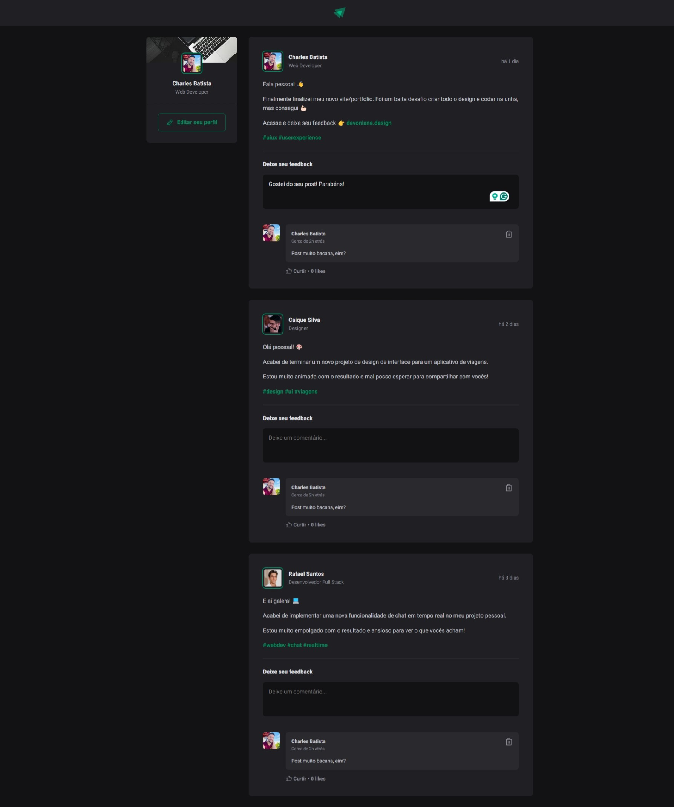

# React + Vite (com TypeScript)

Iniciando estudos sobre os fundamentos do React JS, utilizando o Vite como ferramenta de construção do projeto para otimizar o processo de desenvolvimento da aplicação. Neste projeto específico fiz o uso de TypeScript para tornar nosso código mais inteligente e menos suscetível a erros.

Neste projeto aprendi:
- Fundamentos do ReactJS
- Bundlers & Compilers
- Como criar um projeto React usando Vite
- Conceitos sobre Componentes no React
- CSS Modules
- CSS Global
- Uso do useState
- Comunicação entre componentes
- Iterando sobre objetos, usando key para identificação dos componentes
- Validação simples de formulário
- Aprendendo conceitos iniciais sobre Closures
- Fundamentos do TypeScript
- Criação e Extensão de interfaces

# Resultado do projeto para telas de computadores:

# Resultado do projeto para telas menores:

